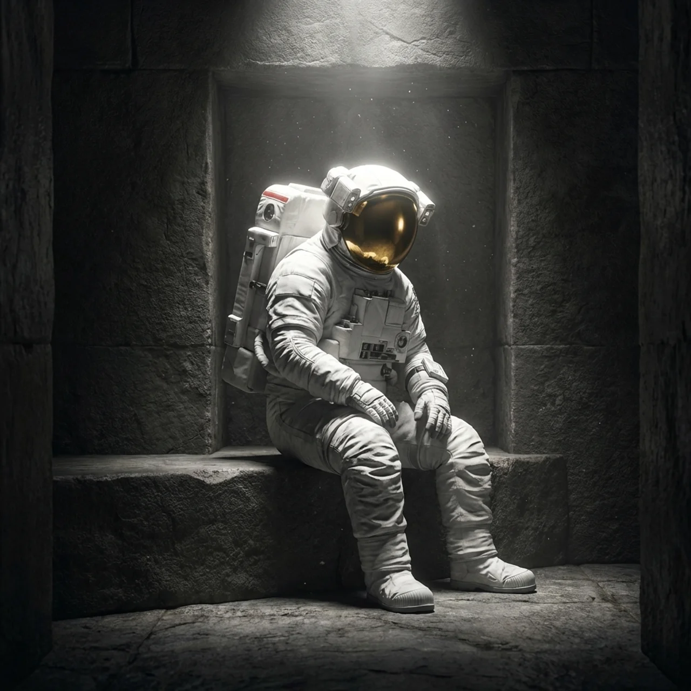

<div align="center">



# 🌌 OneThing

**The local-first Android focus app by Essara.**

*When the list is too loud: brain dump the noise, choose one real task, break it into tiny next steps, then start a calmer focus session.*

<br/>

<a href="https://play.google.com/store/apps/details?id=com.essara.onething">
  
</a>

<br/>

**[🌐 Visit the Official Website](https://kutral.github.io/OneThingSite/)** &nbsp;&nbsp;•&nbsp;&nbsp; **[🚀 Essara Launch Page](https://essara.space/onething)** &nbsp;&nbsp;•&nbsp;&nbsp; **[🔒 Privacy Policy](https://kutral.github.io/OneThingSite/privacy.html)**

</div>

---

## ✨ Overview

This repository holds the cinematic, high-performance landing page for the **OneThing** app. It serves as the primary gateway for users to discover the app and download it directly from the Google Play Store.

### 🚀 What This Site Ships

- **Cinematic Landing Page:** Built with React + Vite + TypeScript + Tailwind CSS.
- **Privacy Policy:** A matching dark, warm-cream page at `privacy.html`.
- **Local Assets:** All media (videos and images) are served locally under `public/assets/` for maximum performance.
- **SEO Optimized:** Canonical tags, robots.txt, sitemap, Open Graph, Twitter cards, app JSON-LD, and Google Search Console verification.
- **Automated CI/CD:** GitHub Actions workflow builds the `dist/` folder and deploys it effortlessly to GitHub Pages.

---

## 🎨 Design System

The visual system is intentionally **dark, quiet, and cinematic**.

| Element | Description |
| :--- | :--- |
| **Background** | True black page background for deep contrast. |
| **Primary Text** | Warm cream (`#E1E0CC`) for reduced eye strain. |
| **Accent Color** | Tailwind primary accent (`#DEDBC8`). |
| **Typography** | *Almarai* for the app UI, paired with *Instrument Serif* italic for expressive emphasis. |
| **Media** | Local MP4 hero media with subtle SVG noise overlays. |
| **Animation** | Framer Motion powers word reveals, card entrances, and scroll-linked text opacity. |

---

## 💻 Local Development

Get up and running locally in seconds.

```bash
# 1. Install dependencies
npm install

# 2. Start the development server
npm run dev
```

The local dev server will be available at: [http://127.0.0.1:5173/](http://127.0.0.1:5173/)

---

## 🏗️ Production Build

To test the production build locally:

```bash
npm run build
```

> **Note:** Vite is configured to build with the `/OneThingSite/` base path to ensure all assets route correctly on GitHub Pages.

---

## 📦 Downloaded Assets

All template assets are bundled locally. No external media dependencies are required during render.

| Local File | Source Role |
| :--- | :--- |
| 🎥 `onething-hero-cinematic.mp4` | Home and privacy hero background video |
| 🎥 `onething-focus-canvas.mp4` | Feature video card background |
| 🖼️ `brain-dump-icon.webp` | Brain Dump feature image |
| 🖼️ `smart-breakdown-icon.webp` | Smart Breakdown feature image |
| 🖼️ `focus-session-icon.webp` | Focus Session feature image |

---

## 🚀 Deployment

Deployment is fully automated via `.github/workflows/deploy.yml`.

On every push to the `main` branch, GitHub Actions:
1. Installs dependencies (`npm ci`)
2. Builds the project (`npm run build`)
3. Uploads the `dist/` directory as a Pages artifact
4. Publishes directly to GitHub Pages

---

<div align="center">
<i>Built with focus, for focus.</i>
</div>
